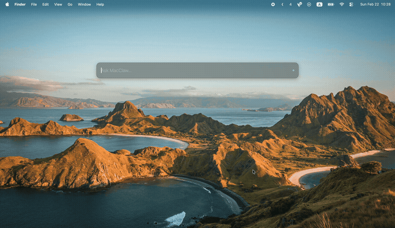

<p align="center">
  <h1 align="center">MacClaw</h1>
  <p align="center">
    Spotlight / Raycast-style macOS client for <strong>OpenClaw</strong><br/>
    Talk to your OpenClaw gateway from a global hotkey — without leaving your current app.
  </p>
  <p align="center">
    
    
    
    
    
    
    
  </p>
</p>

<br/>

> MacClaw is a native macOS desktop client for [OpenClaw](https://github.com/openclaw/openclaw). Press a global hotkey, type a prompt, and get a streaming AI answer — powered by your OpenClaw gateway.

<p align="center">
  
</p>

## Features

| | Feature | Description |
|---|---|---|
| :keyboard: | **Global hotkeys** | Summon the panel from anywhere with `Cmd+Shift+Space`, `Cmd+Shift+K`, or `Alt+Space` |
| :zap: | **Compact idle strip** | Minimal floating bar that stays out of the way |
| :speech_balloon: | **Streaming responses** | Auto-resizing panel with live markdown rendering via OpenClaw chat protocol |
| :electric_plug: | **Slash commands** | `/connect`, `/status` for quick OpenClaw gateway management |
| :art: | **macOS vibrancy** | Native blur-through glass effect (HUD window material) |
| :lock: | **Secure credentials** | Tokens saved via Tauri filesystem; localStorage fallback never stores secrets |
| :arrows_counterclockwise: | **Auto-reconnect** | Re-establishes OpenClaw connection each time the panel is shown |
| :clipboard: | **Copy to clipboard** | One-click copy of any response |

## Quick Start

### Prerequisites

| Dependency | Version |
|---|---|
| [Node.js](https://nodejs.org/) | >= 18 |
| [Rust](https://rustup.rs/) | >= 1.77.2 |
| macOS | >= 11.0 (Big Sur) |
| Running [OpenClaw](https://github.com/openclaw/openclaw) gateway | any |

### Install & Run

```bash
# 1. Install dependencies
npm install

# 2. Launch in dev mode
npm run tauri dev
```

The panel starts **hidden**. Press **`Cmd+Shift+Space`** to toggle it.

### Build for Production

```bash
npm run tauri build
```

The `.app` bundle will be in `src-tauri/target/release/bundle/`.

---

## Connecting to OpenClaw

1. Make sure your [OpenClaw gateway](https://github.com/openclaw/openclaw) is running
2. Press the hotkey to open the panel
3. Type `/connect` and press **Enter**
4. Enter your OpenClaw gateway URL (e.g. `ws://127.0.0.1:19819`) and optional token
5. Click **Connect**

The status dot in the input bar shows connection state:

| Color | State |
|---|---|
| :white_circle: Gray | Disconnected |
| :yellow_circle: Yellow | Connecting to OpenClaw |
| :green_circle: Green | Connected |
| :red_circle: Red | Error |

---

## Keyboard Shortcuts

| Shortcut | Action |
|---|---|
| <kbd>Cmd</kbd>+<kbd>Shift</kbd>+<kbd>Space</kbd> | Toggle panel |
| <kbd>Cmd</kbd>+<kbd>Shift</kbd>+<kbd>K</kbd> | Toggle panel (alt) |
| <kbd>Alt</kbd>+<kbd>Space</kbd> | Toggle panel (alt) |
| <kbd>Enter</kbd> | Send prompt / submit form |
| <kbd>Escape</kbd> | Hide panel |
| <kbd>Arrow Up</kbd> / <kbd>Down</kbd> | Navigate command hints |
| <kbd>Tab</kbd> | Autocomplete slash command |

## Slash Commands

| Command | Description |
|---|---|
| `/connect` | Open OpenClaw gateway connection form |
| `/status` | Show current gateway URL, connection state, and token status |

---

## Architecture

```
src/                          # React + TypeScript frontend
  App.tsx                     # Orchestration and UX flow
  components/
    CommandInput.tsx           # Input bar with status indicator
    CommandHints.tsx           # Autocomplete dropdown for slash commands
    ConnectForm.tsx            # OpenClaw gateway URL + token form
    ResponsePanel.tsx          # Streaming markdown response display
  lib/
    ws-client.ts               # WebSocket client (OpenClaw JSON-RPC protocol)
    commands.ts                # Slash command parsing and matching
    settings.ts                # Settings persistence (Tauri + localStorage fallback)
    panel-window.ts            # Window resize helpers
    __tests__/                 # Unit tests (Vitest)

src-tauri/                     # Rust backend (Tauri v2)
  src/main.rs                  # Global shortcuts, vibrancy, credentials, window lifecycle
  Cargo.toml
  tauri.conf.json
```

## Development

```bash
npm run lint            # ESLint
npm run typecheck       # TypeScript type check
npm run test            # Vitest unit tests
npm run format:check    # Prettier check
npm run check           # lint + test + build (all-in-one)
```

**Rust checks:**

```bash
npm run rust:fmt:check  # cargo fmt
npm run rust:clippy     # cargo clippy
npm run check:all       # frontend + Rust (full CI)
```

---

## Contributing

Contributions are welcome! Please read [CONTRIBUTING.md](CONTRIBUTING.md) before submitting a PR.

## Security

Found a vulnerability? See [SECURITY.md](SECURITY.md) for responsible disclosure guidelines.

## License

This project is licensed under the [MIT License](LICENSE).
