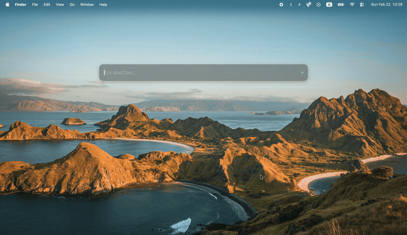

<p align="center">
  <h1 align="center">MacClaw</h1>
  <p align="center">
    Spotlight / Raycast-style macOS client for <strong>OpenClaw</strong><br/>
    Press a hotkey, ask, get a streaming answer. Send the text you have selected in any app with one more hotkey.
  </p>
  <p align="center">
    <a href="https://github.com/itsnex1s/MacClaw/actions/workflows/ci.yml"></a>
    
    
    
    
    
    
    
  </p>
</p>

<br/>

> MacClaw is a small native macOS panel for [OpenClaw](https://github.com/openclaw/openclaw). It talks to any Gateway over the current wire protocol (v4), pairs like every other OpenClaw device, and stays out of the way until you press the hotkey.

OpenClaw's own macOS app ships a Quick Chat bar. MacClaw is the lightweight alternative when you only want the panel: no menu-bar app, a few megabytes of Tauri instead of a bundled runtime, selected-text capture from any application, and answers that keep streaming behind the notch after you dismiss the panel.

<p align="center">
  
</p>

## Features

|                           | Feature                   | Description                                                                                                                      |
| ------------------------- | ------------------------- | -------------------------------------------------------------------------------------------------------------------------------- |
| :keyboard:                | **Global hotkeys**        | Summon the panel with `Cmd+Shift+Space`, `Cmd+Shift+K` or `Cmd+Option+Space`; all three are configurable via `/settings`         |
| :scissors:                | **Selected text capture** | `Cmd+Shift+L` grabs the selection from the frontmost app (Accessibility API, clipboard fallback) and attaches it to your prompt  |
| :zap:                     | **Compact idle strip**    | Minimal floating bar, no Dock icon, hides on blur                                                                                |
| :speech_balloon:          | **Streaming responses**   | Live Markdown rendering of protocol v4 deltas, code blocks with copy buttons                                                     |
| :black_medium_square:     | **Background mode**       | Press Escape while an answer streams and a notch indicator shows progress; click it or press the hotkey to bring the answer back |
| :electric_plug:           | **Slash commands**        | `/connect`, `/settings`, `/status`                                                                                               |
| :art:                     | **macOS vibrancy**        | Native blur-through glass effect (HUD window material)                                                                           |
| :lock:                    | **Keychain secrets**      | Gateway token, password, the device key and issued device tokens live in the login Keychain, never on disk                       |
| :arrows_counterclockwise: | **Resilient connection**  | Device pairing, stored device tokens, exponential backoff up to 30 s and a tick watchdog that detects dead sockets               |
| :framed_picture:          | **Generated images**      | Images the agent produces are fetched through `artifacts.download` and rendered inline                                           |
| :clipboard:               | **Copy to clipboard**     | One-click copy of any response                                                                                                   |

## Quick Start

### Prerequisites

| Dependency                                               | Version                                                    |
| -------------------------------------------------------- | ---------------------------------------------------------- |
| macOS                                                    | 12 (Monterey) or newer                                     |
| [Node.js](https://nodejs.org/)                           | 22 or newer                                                |
| [Rust](https://rustup.rs/)                               | 1.88 or newer                                              |
| [OpenClaw](https://github.com/openclaw/openclaw) Gateway | wire protocol v4 (2026.5 and newer; tested with 2026.6.34) |

### Install & Run

```bash
# 1. Install dependencies
npm install

# 2. Launch in dev mode
npm run tauri dev
```

The panel starts **hidden**. Press **`Cmd+Shift+Space`** to toggle it.

### Build for Production

```bash
npm run tauri build
```

The `.app` bundle will be in `src-tauri/target/release/bundle/`.

---

## Connecting to OpenClaw

1. Run a Gateway with token auth, for example `openclaw gateway --auth token --token <token>` (the default port is `18789`)
2. Press the hotkey, type `/connect` and press **Enter**
3. Enter the Gateway URL (`ws://127.0.0.1:18789`) and the token, then click **Connect**

MacClaw connects as an `operator` client with the `operator.read` and `operator.write` scopes and identifies itself with an Ed25519 device identity that is generated on first use and stored in the Keychain.

### Pairing

Every OpenClaw device has to be paired once. Connections from the same machine (`127.0.0.1`) are approved automatically. For a Gateway on another host, MacClaw shows the pairing request id and keeps retrying; approve it on the Gateway host:

```bash
openclaw devices list
openclaw devices approve <requestId>
```

After approval the Gateway issues a device token. MacClaw stores it in the Keychain and uses it for later connections, so the shared token is only needed for the first pairing. `/status` prints the device id you will see in `openclaw devices list`.

### Remote gateways (LAN, Tailscale)

The Gateway checks the WebSocket origin of UI clients. MacClaw's origin is `tauri://localhost`, which is accepted for loopback connections only. For a remote Gateway allow it in `~/.openclaw/openclaw.json` on the Gateway host:

```json5
{
  gateway: {
    controlUi: { allowedOrigins: ["tauri://localhost"] },
  },
}
```

### Status dot

| Color                  | State                                      |
| ---------------------- | ------------------------------------------ |
| :white_circle: Gray    | Disconnected                               |
| :yellow_circle: Yellow | Connecting or waiting for pairing approval |
| :green_circle: Green   | Connected                                  |
| :red_circle: Red       | Error (`/status` shows the reason)         |

---

## Keyboard Shortcuts

| Shortcut                                          | Action                                         |
| ------------------------------------------------- | ---------------------------------------------- |
| <kbd>Cmd</kbd>+<kbd>Shift</kbd>+<kbd>Space</kbd>  | Toggle panel                                   |
| <kbd>Cmd</kbd>+<kbd>Shift</kbd>+<kbd>K</kbd>      | Toggle panel (alt)                             |
| <kbd>Cmd</kbd>+<kbd>Option</kbd>+<kbd>Space</kbd> | Toggle panel (alt)                             |
| <kbd>Cmd</kbd>+<kbd>Shift</kbd>+<kbd>L</kbd>      | Open the panel with the selected text attached |
| <kbd>Enter</kbd>                                  | Send prompt / submit form                      |
| <kbd>Escape</kbd>                                 | Hide panel (keeps streaming in the background) |
| <kbd>Arrow Up</kbd> / <kbd>Down</kbd>             | Navigate command hints                         |
| <kbd>Tab</kbd>                                    | Autocomplete slash command                     |

The first three are configurable via `/settings`. `Cmd+Shift+L` needs the Accessibility permission for MacClaw (System Settings → Privacy & Security → Accessibility); macOS asks for it on first use.

## Slash Commands

| Command     | Description                                                                              |
| ----------- | ---------------------------------------------------------------------------------------- |
| `/connect`  | Gateway URL and token form                                                               |
| `/settings` | Record the three panel hotkeys                                                           |
| `/status`   | Gateway URL, connection state, token presence, device id and the last connection message |

---

## Architecture

```
src/                          # React + TypeScript frontend
  App.tsx                     # Orchestration and UX flow
  components/
    CommandInput.tsx           # Input bar with status indicator
    CommandHints.tsx           # Autocomplete dropdown for slash commands
    ConnectForm.tsx            # Gateway URL + token form
    SettingsForm.tsx           # Hotkey recorder
    ResponsePanel.tsx          # Streaming Markdown response display
    MediaBlock.tsx             # Artifact and inline images
  features/panel/              # Selected-text prefill and submit resolution
  hooks/                       # Panel lifecycle, resize, command input, WebSocket client
  lib/
    gateway-protocol.ts        # Protocol v4: connect params, device-auth payload, chat events
    ws-client.ts               # WebSocket client: handshake, pairing, reconnect, tick watchdog
    device-auth.ts             # Bridge to the Rust device identity and token store
    media-cache.ts             # artifacts.download cache
    settings.ts                # Settings persistence (Tauri + localStorage fallback)
    __tests__/                 # Vitest unit tests and the opt-in live gateway test

src-tauri/                     # Rust backend (Tauri v2)
  src/main.rs                  # Global shortcuts, vibrancy, window lifecycle
  src/identity.rs              # Ed25519 device identity and challenge signing
  src/secrets.rs               # Keychain access
  src/credentials.rs           # Settings file and device tokens
  src/panel.rs, notch.rs       # Panel and notch windows
  src/selection.rs             # Selected text capture
```

## Security

- The Gateway token, password, the device private key and issued device tokens are stored in the login Keychain under the service `ai.macclaw.panel`. The settings file in `~/Library/Application Support/ai.macclaw.panel/` only holds the URL, agent id, session key and hotkeys. Files written by MacClaw 0.1 are migrated on first start.
- MacClaw requests only `operator.read` and `operator.write`; it cannot change Gateway configuration.
- Development builds are signed ad hoc, so macOS may ask for Keychain access again after a rebuild.

## Development

```bash
npm run lint            # ESLint
npm run format:check    # Prettier
npm run typecheck       # TypeScript type check
npm run test            # Vitest unit tests
npm run check           # lint + test + build (all-in-one)
npm run rust:fmt:check  # cargo fmt
npm run rust:clippy     # cargo clippy
npm run rust:test       # cargo test
npm run check:all       # frontend + Rust (what CI runs)
```

`MACCLAW_CONFIG_DIR` points the app at another settings directory, handy for trying a second gateway without touching your own configuration.

The live gateway test runs the real client against a Gateway you point it at:

```bash
MACCLAW_GATEWAY_URL=ws://127.0.0.1:18789 MACCLAW_GATEWAY_TOKEN=<token> npx vitest run gateway.live
```

## Troubleshooting

| Message                      | What to do                                                                             |
| ---------------------------- | -------------------------------------------------------------------------------------- |
| `Pairing required`           | Run `openclaw devices approve <requestId>` on the Gateway host; MacClaw keeps retrying |
| `Gateway token mismatch`     | Open `/connect` and paste the current token                                            |
| `rejected MacClaw's origin`  | Add `tauri://localhost` to `gateway.controlUi.allowedOrigins` (remote gateways)        |
| `different protocol version` | Update MacClaw or the Gateway; both must speak protocol v4                             |
| `No selected text found`     | Grant MacClaw the Accessibility permission and retry                                   |

## Contributing

Contributions are welcome! Please read [CONTRIBUTING.md](CONTRIBUTING.md) before submitting a PR.

## Security policy

Found a vulnerability? See [SECURITY.md](SECURITY.md) for responsible disclosure guidelines.

## License

This project is licensed under the [MIT License](LICENSE).
